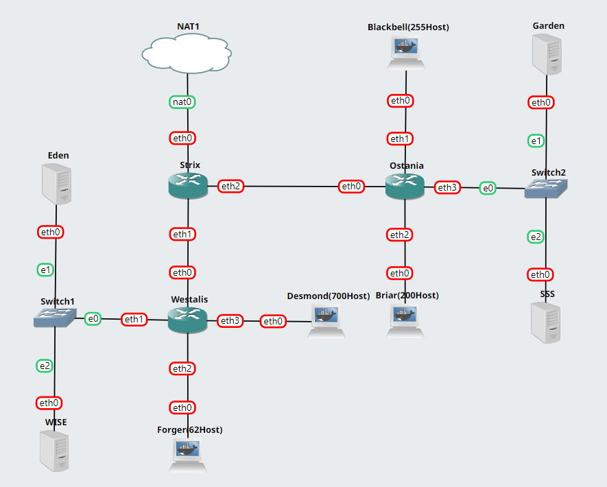
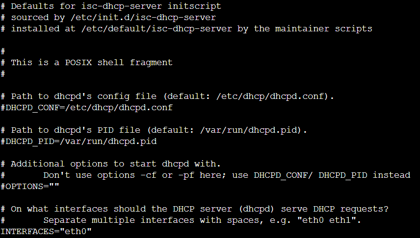
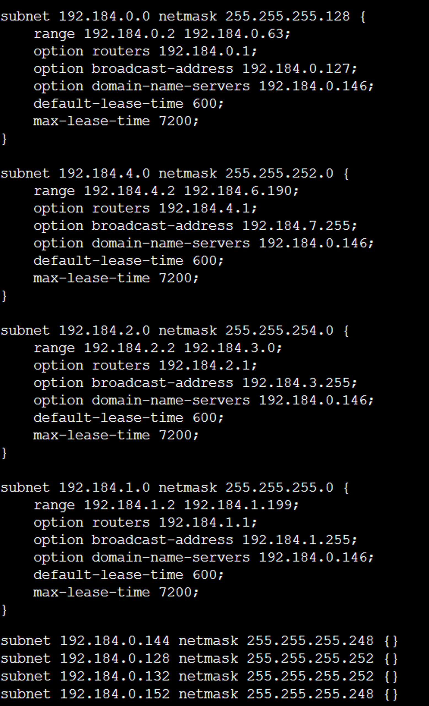
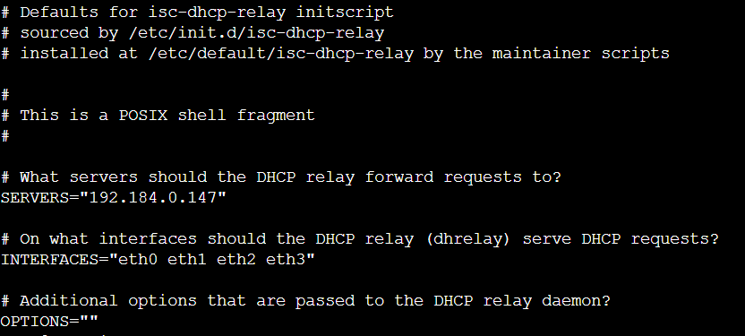
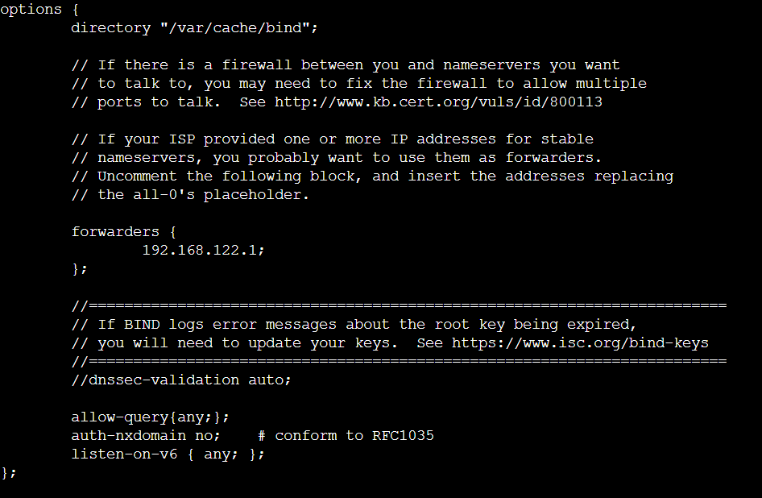
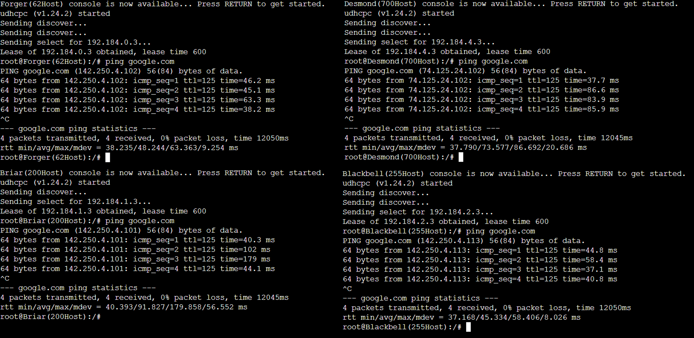

# Jarkom-Modul-4-C10-2022

**Laporan Resmi Praktikum Jarkom Modul 5** - _Firewall_

#### Anggota Kelompok C10:

| Nama                   | NRP        |
| ---------------------- | ---------- |
| Pierra Muhammad Shobr  | 5025201062 |
| Barhan Akmal Falahudin | 5025201008 |
| Arief Badrus Sholeh    | 5025201228 |

> Prefiks IP kelompok C10 -> 192.184

Setelah kalian mempelajari semua modul yang telah diberikan, Loid ingin meminta bantuan untuk terakhir kalinya kepada kalian. Dan kalian dengan senang hati mau membantu Loid.

### Soal A

> Tugas pertama kalian yaitu membuat topologi jaringan sesuai dengan rancangan yang diberikan Loid.

#### Topologi



Keterangan:

- `Eden` adalah DNS Server
- `WISE` adalah DHCP Server
- `Garden` dan `SSS` adalah Web Server
- Jumlah Host pada `Forger` adalah 62 host
- Jumlah Host pada `Desmond` adalah 700 host
- Jumlah Host pada `Blackbell` adalah 255 host
- Jumlah Host pada `Briar` adalah 200 host

### Soal B

> Untuk menjaga perdamaian dunia, Loid ingin meminta kalian untuk membuat topologi tersebut menggunakan teknik CIDR atau VLSM setelah melakukan subnetting.

#### Menentukan jumlah subnet pada Topologi

#### Menentukan jumlah IP yang dibutuhkan pada subnet

#### Menghitung pembagian IP berdasarkan NID dan Netmask yang didapatkan

#### Hasil Pembagian IP

### Soal C

> Anya, putri pertama Loid, juga berpesan kepada anda agar melakukan Routing agar setiap perangkat pada jaringan tersebut dapat terhubung.

#### Network Configuration

##### Router

- `Strix`

```
auto eth0
iface eth0 inet dhcp

auto eth1
iface eth1 inet static
	address 192.184.0.129
	netmask 255.255.255.252

auto eth2
iface eth2 inet static
	address 192.184.0.133
	netmask 255.255.255.252
```

- `Westalis`

```
auto eth0
iface eth0 inet static
	address 192.184.0.130
	netmask 255.255.255.252

auto eth1
iface eth1 inet static
	address 192.184.0.145
	netmask 255.255.255.248

auto eth2
iface eth2 inet static
	address 192.184.0.1
	netmask 255.255.255.128

auto eth3
iface eth3 inet static
	address 192.184.4.1
	netmask 255.255.252.0
```

- `Ostania`

```
auto eth0
iface eth0 inet static
	address 192.184.0.134
	netmask 255.255.255.252

auto eth1
iface eth1 inet static
	address 192.184.2.1
	netmask 255.255.254.0

auto eth2
iface eth2 inet static
	address 192.184.1.1
	netmask 255.255.255.0

auto eth3
iface eth3 inet static
	address 192.184.0.153
	netmask 255.255.255.248
```

##### Server

- `Eden`

```
auto eth0
iface eth0 inet static
	address 192.184.0.146
	netmask 255.255.255.248
	gateway 192.184.0.145
```

- `WISE`

```
auto eth0
iface eth0 inet static
	address 192.184.0.147
	netmask 255.255.255.248
	gateway 192.184.0.145
```

- `Garden`

```
auto eth0
iface eth0 inet static
	address 192.184.0.154
	netmask 255.255.255.248
	gateway 192.184.0.153
```

- `SSS`

```
auto eth0
iface eth0 inet static
	address 192.184.0.155
	netmask 255.255.255.248
	gateway 192.184.0.153
```

##### Client

Pada Client, IP diberikan secara dinamis menggunakan DHCP. Konfigurasi terdapat pada [Soal D](#soal-d)

- `Forger(62Host)`

```
auto eth0
iface eth0 inet dhcp
```

- `Desmond(700Host)`

```
auto eth0
iface eth0 inet dhcp
```

- `Blackbell(255Host)`

```
auto eth0
iface eth0 inet dhcp
```

- `Briar(200Host)`

```
auto eth0
iface eth0 inet dhcp
```

#### Static Routing Configuration

- `Strix`

```
route add -net 192.184.0.144 netmask 255.255.255.248 gw 192.184.0.130
route add -net 192.184.0.0 netmask 255.255.255.128 gw 192.184.0.130
route add -net 192.184.4.0 netmask 255.255.255.0 gw 192.184.0.130

route add -net 192.184.2.0 netmask 255.255.254.0 gw 192.184.0.134
route add -net 192.184.1.0 netmask 255.255.255.0 gw 192.184.0.134
route add -net 192.184.0.152 netmask 255.255.255.248 gw 192.184.0.134
```

- `Westalis`

```
rote add -net 0.0.0.0 netmask 0.0.0.0 gw 192.184.0.129
```

- `Ostania`

```
route add -net 0.0.0.0 netmask 0.0.0.0 gw 192.184.0.133
```

### Soal D

> Tugas berikutnya adalah memberikan ip pada subnet `Forger`, `Desmond`, `Blackbell`, dan `Briar` secara dinamis menggunakan bantuan DHCP server. Kemudian kalian ingat bahwa kalian harus setting DHCP Relay pada router yang menghubungkannya.

#### Konfigurasi pada `WISE` sebagai DHCP Server

`Wise` digunakan sebagai DHCP Server, sehingga perlu beberapa konfigurasi dilakukan. Pertama lakukan `apt-get update` dan instalasi `sisc-dhcp-server`. Kemudian,

- `/etc/default/isc-dhcp-server`
  > Menentukan interfaces yang digunakan yaitu eth0



- `/etc/dhcp/dhcpd.conf`
  > Konfigurasi subnet yang melalui `Westalis` dan `Ostania`



#### Konfigurasi pada `Westalis` dan `Ostania` sebagai DHCP Relay

`Westalis` dan `Ostania` digunakan sebagai DHCP Relay, sehingga perlu beberapa konfigurasi dilakukan. Pertama lakukan `apt-get update` dan instalasi `isc-dhcp-relay`. Kemudian,

- `/etc/default/isc-dhcp-relay`
  Memasukkan IP DHCP Server yaitu `192.184.0.147` dan menentukan interface yang digunakan yang melalui setiap switch yaitu eth0, eth1, eth2, dan eth3



#### Konfigurasi pada `Eden` sebagai DNS Server

`Eden` digunakan sebagai DNS Server, sehingga perlu beberapa konfigurasi dilakukan. Pertama lakukan `apt-get update` dan instalasi `bind9`. Kemudian,

- `/etc/bind/named.conf.options`
  > Setting forwarders agar node dapat terhubung ke internet



#### Testing

Testing untuk melihat apakah client sudah bisa mendapatkan IP dan lakukan ping ke `google.com`



Selain itu dilakukan juga konfigurasi pada `Garden` dan `SSS` sebagai Web Server

#### Konfigurasi pada `Garden` dan `SSS` sebagai Web Server

```
apt-get update

apt install apache2 -y

service apache2 start

echo "$HOSTNAME" > /var/www/html/index.html
```

## FIREWALL

### Soal 1

> Agar topologi yang kalian buat dapat mengakses keluar, kalian diminta untuk mengkonfigurasi Strix menggunakan iptables, tetapi Loid tidak ingin menggunakan MASQUERADE.

#### Konfigurasi

#### Testing

### Soal 2

> Kalian diminta untuk melakukan drop semua TCP dan UDP dari luar Topologi kalian pada server yang merupakan DHCP Server demi menjaga keamanan.

#### Konfigurasi

#### Testing

### Soal 3

> Loid meminta kalian untuk membatasi DHCP dan DNS Server hanya boleh menerima maksimal 2 koneksi ICMP secara bersamaan menggunakan iptables, selebihnya didrop.

#### Konfigurasi

#### Testing

### Soal 4

> Akses menuju Web Server hanya diperbolehkan disaat jam kerja yaitu Senin sampai Jumat pada pukul 07.00 - 16.00.

#### Konfigurasi

#### Testing

### Soal 5

> Karena kita memiliki 2 Web Server, Loid ingin Ostania diatur sehingga setiap request dari client yang mengakses Garden dengan port 80 akan didistribusikan secara bergantian pada SSS dan Garden secara berurutan dan request dari client yang mengakses SSS dengan port 443 akan didistribusikan secara bergantian pada Garden dan SSS secara berurutan.

#### Konfigurasi

#### Testing

### Soal 6

> Karena Loid ingin tau paket apa saja yang di-drop, maka di setiap node server dan router ditambahkan logging paket yang di-drop dengan standard syslog level.

#### Konfigurasi

#### Testing

## Kendala

Berikut kendala yang kami alami selama mengerjakan praktikum modul 5.

-
